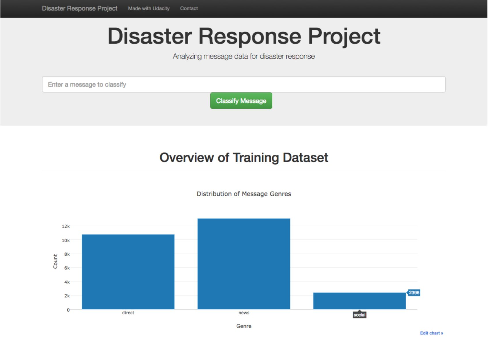
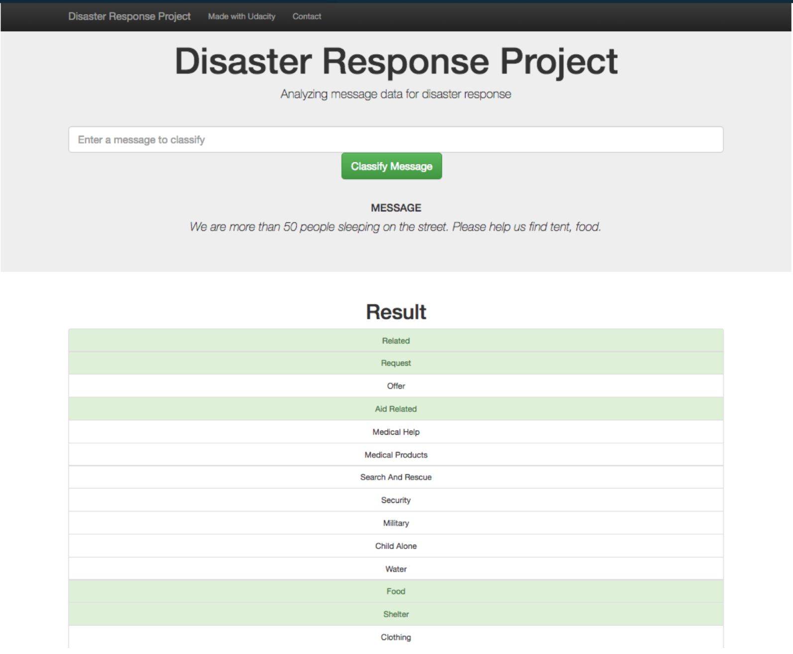

# Disaster Response Pipeline Project
In this project, we will build a model to classify messages that are sent during disasters. There are 36 pre-defined categories, and examples of these categories include Aid Related, Medical Help, Search And Rescue, etc. By classifying these messages, we can allow these messages to be sent to the appropriate disaster relief agency. This project will involve the building of a basic ETL and Machine Learning pipeline to facilitate the task. This is also a multi-label classification task, since a message can belong to one or more categories. We will be working with a data set provided by Figure Eight containing real messages that were sent during disaster events.

Finally, this project contains a web app where you can input a message and get classification results.

## Data

For this project, we will be using disaster data from [appen](https://appen.com/).

## Project Components

### 1. ETL Pipeline

In a Python script, process_data.py,  we write a data cleaning pipeline that:
* Loads the messages and categories datasets
* Merges the two datasets
* Cleans the data
* Stores it in a SQLite database

### 2.ML Pipeline

In a Python script, train_classifier.py, we write a machine learning pipeline that:
* Loads data from the SQLite database
* Splits the dataset into training and test sets
* Builds a text processing and machine learning pipeline
* Trains and tunes a model using GridSearchCV
* Outputs results on the test set
* Exports the final model as a pickle file

### 3. Flask Web App

* we are using  flask, html to our Web App
*data visualizations using Plotly in the web app

### Instructions:
1. Run the following commands in the project's root directory to set up your database and model.

    - To run ETL pipeline that cleans data and stores in database
    
        `python data/process_data.py data/disaster_messages.csv data/disaster_categories.csv data/DisasterResponse.db`
    
    - To run ML pipeline that trains classifier and saves
    
        `python models/train_classifier.py data/DisasterResponse.db models/classifier.pkl`
       

2. Go to `app` directory: `cd app`

3. Run your web app: `python run.py`

## Web App 

#### A credit to Udacity
This project is part of the BOSCH AI TALENT ACCELERATOR (Udacity Nanodegree).
